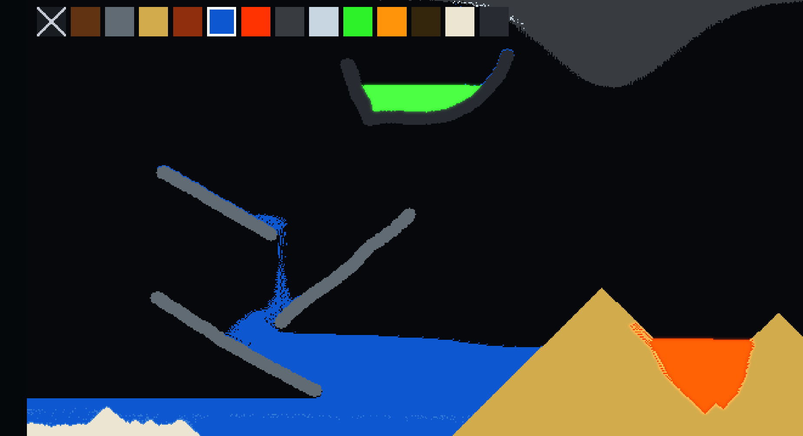

# PixelSim

A small **Noita-style cellular-material sandbox** for Windows, implemented in C with D3D11.

 

## Design

The simulation is a 640 × 360 pair of `R32_UINT` GPU textures. Physics advances at an exact fixed 120 updates per second, independently of presentation FPS, with at most four catch-up updates after a stall. The low byte of each cell stores its material, and falling powders and liquids carry vertical velocity in a packed metadata byte.

Each update uses five conflict-free compute dispatches. A 2 × 2 checkerboard material pass handles diagonal powder rolls, gases, displacement, and reactions, and a column-owned pass applies vertical acceleration to powders and liquids. Three in-place row-color dispatches then transfer liquid pressure; active rows are separated by three cells, so their two-row support footprints never overlap. Every active row is loaded cooperatively into group-shared memory, obstacle segments are identified in parallel, and shared atomics select at most one conservative source/destination swap per segment. All six color orders rotate across updates to balance ordering bias. Airborne liquid falls straight instead of treating other falling liquid as stable support, while a pool whose column depths differ by at most one cell is a stable discrete equilibrium. Vertical movement ray-marches every crossed cell and stops before obstacles, horizontal pressure never crosses a solid wall, and lava stops at water so accelerated motion cannot skip the reaction. The pixel shader masks the packed state and renders it into a floating-point scene target. A material-aware half-resolution emission pass includes fire, lava, and acid; a separable Gaussian blur creates the bloom texture, which is composited with the scene before the text overlay. Bright non-emissive materials and UI elements do not contribute to bloom.

The CPU never uploads the world texture. Mouse events enqueue 20-byte `sim_brush_command` values—including erase commands whose material type is empty—and an in-place GPU `ApplyBrush` dispatch touches only the clipped brush rectangle before the usual physics passes. Holding the mouse still does not repeatedly deposit material. UI text uses a one-time `stb_truetype` atlas built from the Windows Segoe UI font and a separate alpha-blended D3D11 overlay pass.

| Family | Materials | Behavior |
| --- | --- | --- |
| Solid | wood, iron, bedrock | Iron is immovable until adjacent rust or acid erodes it. Bedrock is permanent and resists heat, rust, and acid. |
| Powder | sand, rust, salt | Powders accelerate, roll, and sink through less-dense liquids. Rust propagates into iron; salt grains gradually dissolve into adjacent water and turn it into visibly lighter brine. |
| Liquid | water, lava, acid, oil | Liquids accelerate and level under pressure. Water cools lava and extinguishes fire, green acid dissolves ordinary materials, and buoyant oil floats on water and burns. |
| Gas | smoke, steam, fire | Gases rise and drift. Steam can condense; fire spreads through wood and oil before aging into smoke. |
